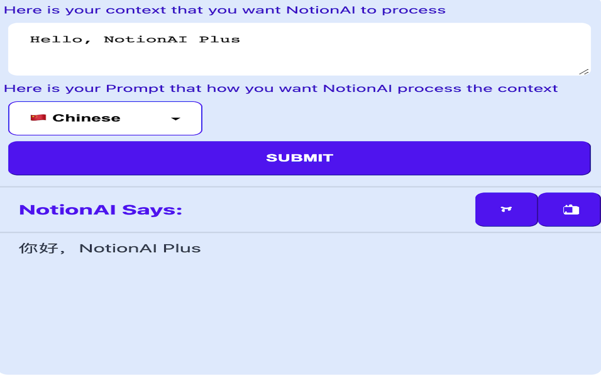
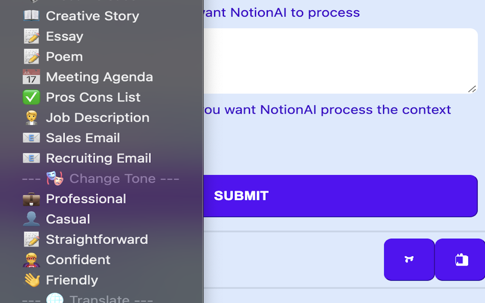
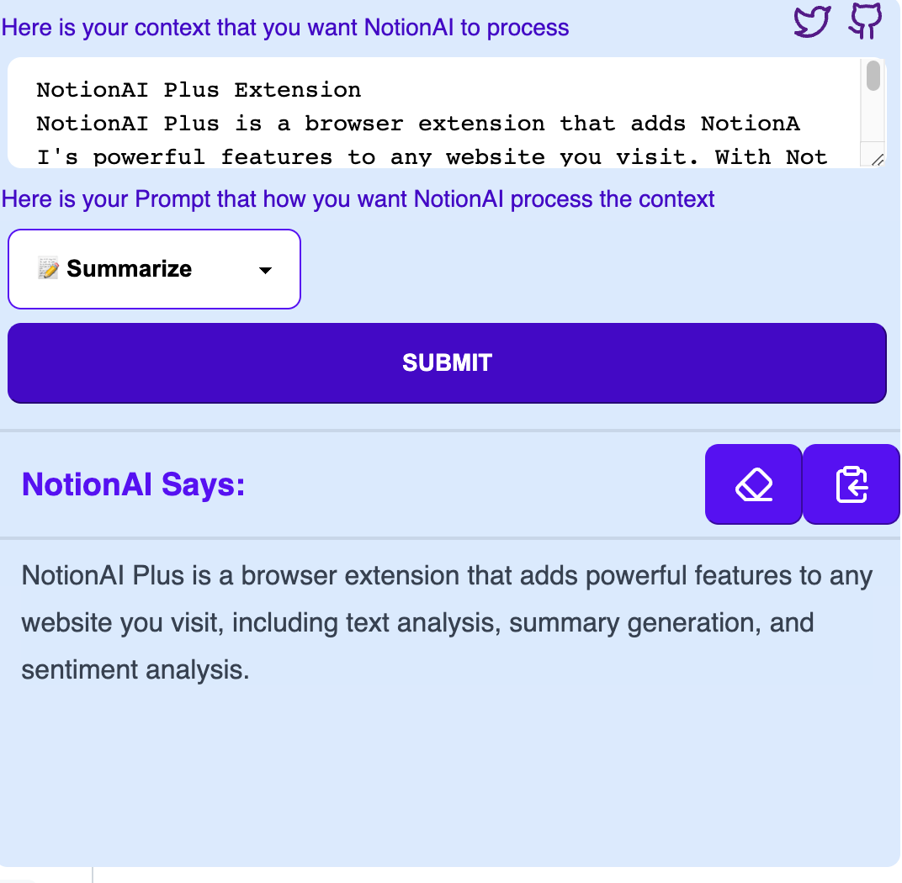
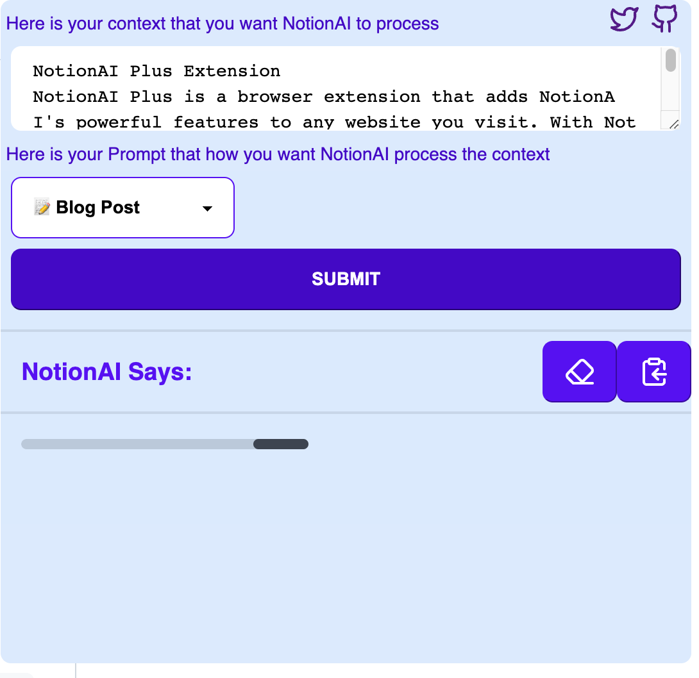
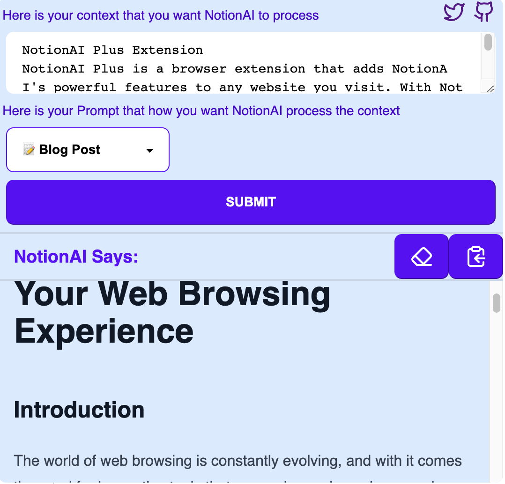
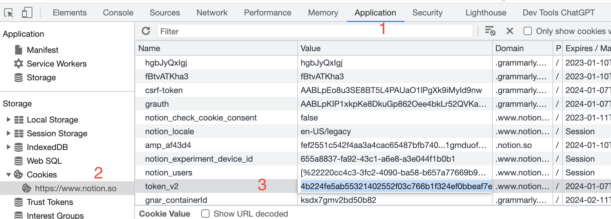
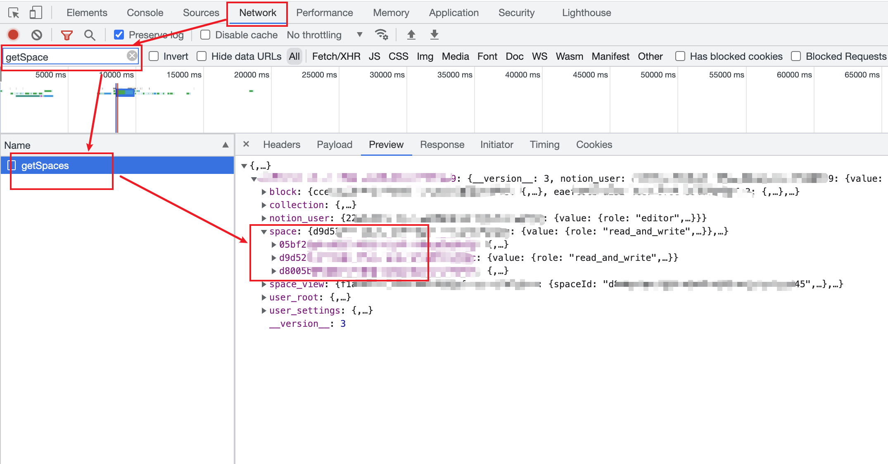

# NotionAI

NotionAI is an unofficial NotionAI API that provides a Python SDK and a Chrome extension.

## NotionAI Plus Extension

NotionAI Plus is a browser extension that adds NotionAI's powerful features to any website you visit. With NotionAI Plus, you can easily analyze text, generate summaries, and perform sentiment analysis on any webpage.

- [Chrome Web Store](https://chrome.google.com/webstore/detail/notionai-plus/ilgkcoockdhdpkikaakkjacblhpmdmeo)
- [Firefox Addon](https://addons.mozilla.org/en-US/firefox/addon/notionai-plus/)


### NotionAI Chrome Extension Demo


https://user-images.githubusercontent.com/10231735/221889423-17fe70e3-2be6-40b3-84b6-57a3333510f0.mp4


#### Screen Capture

|            Screen Capture 1            |            Screen Capture 2            |            Screen Capture 3            |            Screen Capture 4            |            Screen Capture 5            |
| :------------------------------------: | :------------------------------------: | :------------------------------------: | :------------------------------------: | :------------------------------------: |
|  |  |  |  |  |


## NotionAI Python SDK

The NotionAI Python SDK is a wrapper for the NotionAI APIs with Python bindings, simplifying integration of NotionAI solutions into your projects.

### Features

- Full APIs from Notion AI
- Support stream response

### API

All NotionAI functionalities are supported. Check out the [notionai.py](./notionai/notionai.py) file to see all the available APIs.

#### Basic API Shortcuts

APIs like `blog_post`, `help_me_write`, `help_me_edit`, and `summarize` are shortcuts for the basic APIs.

#### Advanced APIs

We also support advanced APIs that allow you to dispatch by parameters:

1. `writing_with_topic`
    ```
    Writing for special topic
    Args:
        topic (TopicEnum): the special topic
        prompt (str): prompt for writing
    Example:
        ao = NotionAI(token)
        ai.writing_with_topic(TopicEnum.blog_post, "Please help to introduce Notion")
    ```
2. `writing_with_prompt`
    ```
    Writing with special prompt, like summarize, explain_this, improve_writing

    Args:
        prompt_type (PromptTypeEnum): special prompt
        context (str): the context for your writing

    Example:
        ai = NotionAI(token)
        ai.writing_with_prompt(PromptTypeEnum.summarize, "I am a student")
    ```
3. `translate`
    ```
    Translate the text
    Args:
        language (TranslateLanguageEnum): target language
        context (str): context to translate

    Example:
        ai = NotionAI(token)
        ai.translate(TranslateLanguageEnum.Chinese, "I am a student")
    ```
4. `change_tone`
   ```
    Change the tone of your context
    Args:
        context (str): context to change
        tone (ToneEnum): target tone

    Returns:
        str: Response from NotionAI
    Example:
        ai = NotionAI(token)
        ai.change_tone("I am a student", ToneEnum.professional)
   ```

### Usage

#### Install

`pip install --upgrade notionai-py`


#### Get Notion Token and Workspace ID

To use the NotionAI Python SDK, you need to obtain a Notion token. You can do this by following these steps:

1. Open Chrome or Firefox DevTools
2. Find Cookies and copy the value for `token_v2`
3. Find the `spaceId` of your Notion workspace

- get notion token

- get notion workspace id


**Note: Now can get Notion space id using api**

```python
import os
from notionai import NotionAI
TOKEN = os.getenv("NOTION_TOKEN")

spaces = NotionAI.get_spaces(TOKEN)
print(spaces)
# the result will looks like
# [{'id': 'xxxxx', 'name': 'xxxxx'}]

```


#### Examples

Check out the [examples](./examples/) directory for usage examples.

1. Basic

```python
import os
from notionai import NotionAI

TOKEN = os.getenv("NOTION_TOKEN")
SPACE_ID = os.getenv("NOTION_SPACE_ID")

def main():
    ai = NotionAI(TOKEN, SPACE_ID)
    res = ai.blog_post("write a blog about the meaning of life")
    print(res)

if __name__ == "__main__":
    main()

```

2. Stream API

```python
import os
import sys
from notionai import NotionAI

TOKEN = os.getenv("NOTION_TOKEN")
SPACE_ID = os.getenv("NOTION_SPACE_ID")

def main():
    ai = NotionAIStream(TOKEN, SPACE_ID)
    res = ai.blog_post("write a blog about the meaning of life")
    for item in res:
        sys.stdout.write(item)


if __name__ == "__main__":
    main()
```


3. WebUI

Check out the [webui](./examples/webui/README.md) directory for instructions on how to use the NotionAI Python SDK with a web user interface.
