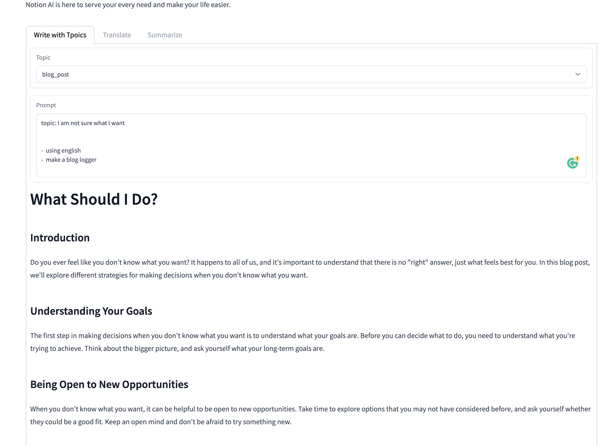

# Example WebUI

use gradio build an example webui

## Usage

1. Create a venv: `python -m venv .venv` and activate it: `source .venv/bin/activate`
2. install requirements: `pip install -r requirements.txt`
3. `python app.py`
4. open browser: http://127.0.0.1:7860

## Screenshots

